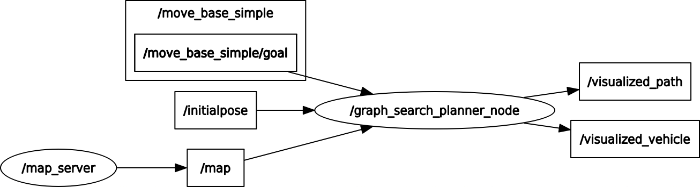
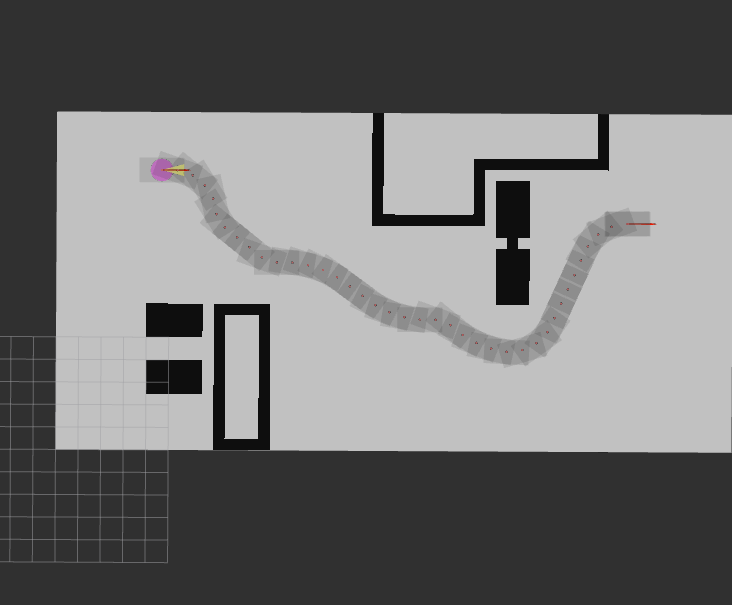
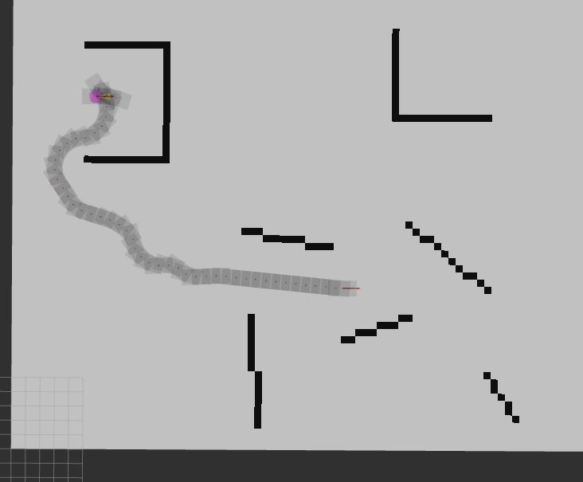
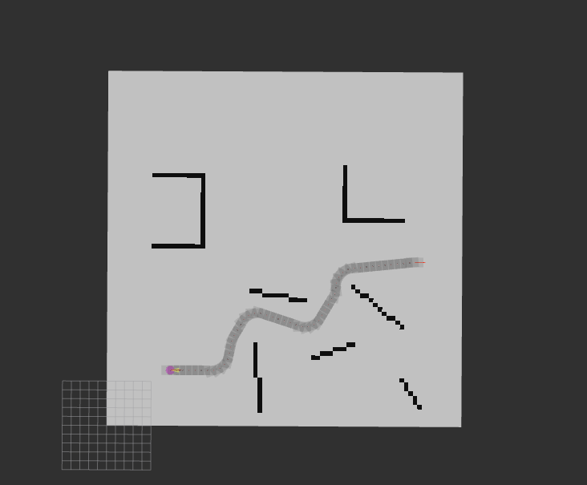

# Motion Planning With Carla Simulator

## 1. Free Space Planner

hybrid a star is the main planner for open space planner. Note that this planner is not integrated with carla simulator.

### 1.1 Dependencies

- Ubuntu18.04
- ROS Melodic

### 1.2 Ros Graph

    
     
    <em> rosgraph for Hybrid A Star</em>

### 1.3 Result

    
     
    <em> hybrid_astar_result </em>

    
     
    <em> hybrid_astar_result </em>

    
     
    <em> hybrid_astar_result </em>

### 1.4 TODO

- [ ] path smooth

- [ ] assign velocity profile

### Reference

[1]  [Apollo Open Space Planner](https://github.com/ApolloAuto/apollo/tree/master/modules/planning) 

[2] [Hybrid A* Path Planner for the KTH Research Concept Vehicle](https://github.com/karlkurzer/path_planner)

## 2. Structed Planner

### 2.1 Dependencies

- Ubuntu18.04
- ROS Melodic
- carla-simulator 0.9.9
- carla-ros-bridge

### 2.2 carla route planner

### 2.3 state lattice planner 

### 2.4 frenet state lattice

### 2.5 ssc planner

